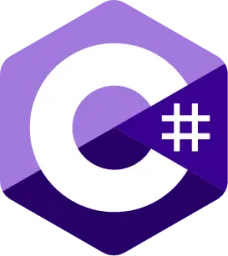
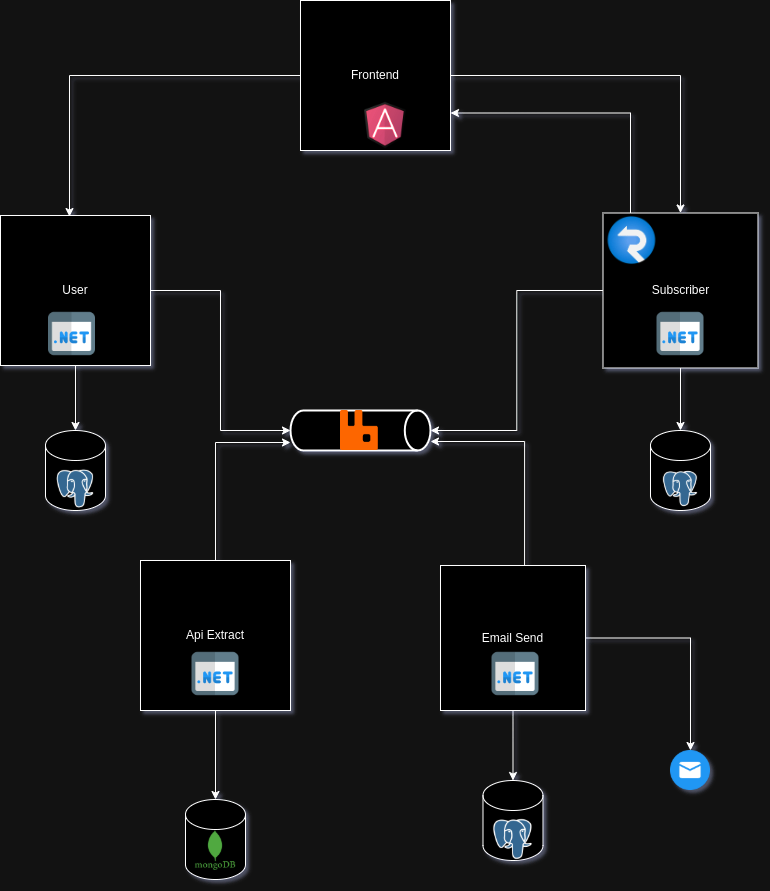

# razvan-stock-news

This is my computer engineering bachelor's degree project which was developed using Angular for frontend and ASP.NET with .NET 6 on backend.

The architecture was microservices and events were sent usign MassTransit framework and RabbitMq as message queue service.

Each microservices has it's own databse, one microservice has mongo db and the others have PostgreSQL. 

This is the system's diagram: 

The **User** API microservice is used only for authentication.

The **Subscriber** API is used for all the operations on subscribers (get statistics which are shown only for users, subsribe and unsubscribe). It uses SignalR for updating the UI charts in real time every time a new subscriber appears or a new subscriber decides to not see the news.

The **Api Extract** is used for extracting the prices for some companies selected and making after that a regression for predicting the next price (initially the data source was an API from yahoo finance but after becoming paid, I needed to chardcode the structure to make it functional).
Data is stored in a mongo db database. 

The **Email Send** is responsible for sending emails. It receives data from subsriber when he is subscribed or unsubscribed for storing emails on it's own database.
It is also responsible for sending emails with data received from the Api Extract microservice

